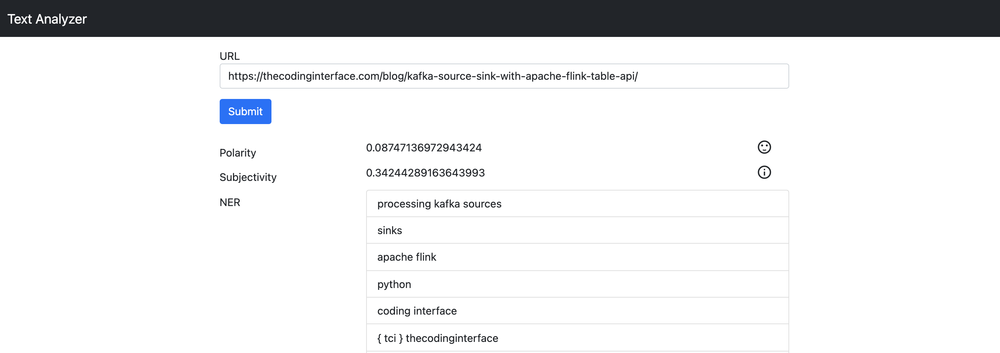

# Containerized Textblob NLP System

This repo is a collection of containerized components collectively forming a natural language processing (NLP) application.

### Architecture Breakdown


From a user experience vantage you request the web frontend home page, submit a url of a webpage you'd like to perform NLP Analysis on, and the application presents the results of sentiment polarity, sentiment subjectivity, along with named entity recognition (aka, noun phrase extraction).



There are four major components of this architecture: frontend, kafka, nlp analysis, redis

__1) Frontend App__

The code for this part of the system is in the `nlpapp` directory.

This is a more traditional monolith style application build on top of the Python based Flask micro webframework which serves up a single interactive HTML, Bootstrap CSS and Vue.js based UI where a user submits a URL of a webpage to perform NLP Analysis on. The Flask frontend also exposes two REST endpoints that are consumed by the UI, one for submitting (aka, publishing) the URL for analysis `POST /analyze-text { url: str }` and another for fetching NLP Analysis results `GET /analysis-results?url=str`. 

__2) Kafka__

The Kafka component simply serves as a pub/sub message queue for decoupling the `/analyze-text` REST endpoint publisher of the frontend app from the NLP Analysis consumer process. The publisher publishes individual urls to a Kafka topic named urls and a consumer consumes the urls.

__3) NLP Analysis__

The code for this is in the `nlpconsumer` directory.

This part of the system is where the actual NLP Analysis is performed. The application is a Kafka consumer which subscribes to the urls topic, pulling them off one by one, fetching the webpage contents, then performing NLP on the text before finally storing the results in redis.

__4) Redis__

The redis component is a simple key/value store for associating urls (key) to NLP analysis results (value).


### Local Development (without Docker Compose)

In this mode of development one would spin a standalone development Kafka cluster and redis instance using the docker-compose.yaml file in the localdevtest directory. Then nlpapp and nlpconsumer can be separately launched.

First spin up the Docker services.

```
cd localdevtest
docker-compose up -d
```

At this point you should now be able to request http://127.0.0.1:5000 in your browser and be served up the application frontend.

### Local Development with Kubernetes

In order to developer, test, and experiment with this application locally using Kubernetes you will need a locally installed and running kubernetes cluster along with the helm kubernetes package / template manager installed locally.

I will not be providing instructions on how to install and configure kubernetes locally but, there is a Vagrant file that included in this repository that can be used to provision a linux VM using Virtual Box which you could then install Kubernetes on such as k3s. Some other options are minikube as well as the kubernetes integration in Docker Desktop.

Ensure that your kubectl / kubeconifg is set with the active context to your local kubernetes install.

First you will want to fetch the Kafka helm chart.

```
helm repo add bitnami https://charts.bitnami.com/bitnami
```

Then install the Kafka helm chart.

```
helm install kafka bitnami/kafka
```

You can verify the Kafka install by launching a Kafka client pod on kubernetes.

```
kubectl run kafka-client \
  --restart='Never' \
  --image docker.io/bitnami/kafka:2.8.1-debian-10-r0 \
  --namespace default \
  --command -- sleep infinity
```

Connect to the Kafka client pod.

```
kubectl exec --tty -i kafka-client --namespace default -- bash
```

Produce some test messages to a Kafka topic named test (ctrl + C to exit after entering some messages).

```
kafka-console-producer.sh \
    --broker-list kafka-0.kafka-headless.default.svc.cluster.local:9092 \
    --topic test
```

Consume the test message with a Kafka consumer.

```
kafka-console-consumer.sh \
    --bootstrap-server kafka.default.svc.cluster.local:9092 \
    --topic test \
    --from-beginning
```

Launch the remaining NLP Application from the local helm chart in the helm directory. Issue the next command from the project root (ie, along side the helm directory)

```
helm install nlp ./helm
```

A new namespace named nlp-local will be created in the k8s cluster. Issue the following to see the k8s resources installed in the new namespace.

```
kubectl get all --namespace nlp-local
```

example output

```
NAME                               READY   STATUS    RESTARTS   AGE
pod/nlpapp-76867686f6-2rrdx        1/1     Running   0          2m5s
pod/nlpapp-76867686f6-ntbn9        1/1     Running   0          2m5s
pod/nlpconsumer-5b597cd6fd-652w7   1/1     Running   0          12s
pod/redis-fd794cd65-ttm7d          1/1     Running   0          12s

NAME             TYPE        CLUSTER-IP     EXTERNAL-IP   PORT(S)          AGE
service/nlpapp   NodePort    10.43.238.44   <none>        5000:32278/TCP   2m5s
service/redis    ClusterIP   10.43.52.8     <none>        6379/TCP         12s

NAME                          READY   UP-TO-DATE   AVAILABLE   AGE
deployment.apps/nlpapp        2/2     2            2           2m5s
deployment.apps/nlpconsumer   1/1     1            1           12s
deployment.apps/redis         1/1     1            1           12s

NAME                                     DESIRED   CURRENT   READY   AGE
replicaset.apps/nlpapp-76867686f6        2         2         2       2m5s
replicaset.apps/nlpconsumer-5b597cd6fd   1         1         1       12s
replicaset.apps/redis-fd794cd65          1         1         1       12s
```

Fetch info for the frontend nlpapp service to identify the NodePort that was assigned to it so you can use it to access the webpage from your local environment.

```
kubectl get svc nlpapp --namespace nlp-local
```

example output

```
NAME     TYPE       CLUSTER-IP     EXTERNAL-IP   PORT(S)          AGE
nlpapp   NodePort   10.43.238.44   <none>        5000:32278/TCP   2m36s
```

In the example output shown the NodePort is 32278 and since I installed my local kubernetes cluster using the Vagrant file in this repo with VirtualBox I know the IP address for that VM is 192.168.50.4 and thus I can reach the application locally in my browser with http://192.168.50.4:32278

### Installing on AWS EKS

To simplify creating EKS clusters I'm opting to use the [eksctl CLI](https://eksctl.io/) so, to follow along please install as described in the official docs. 

First spin up a basic EKS cluster. This will take around 15 minutes to provision.

```
cd eksctl
./launch.sh NAME-OF-AWS-PROFILE
```

Next install Kafka via helm by fetching the Kafka helm chart.

```
helm repo add bitnami https://charts.bitnami.com/bitnami
```

Then install the Kafka helm chart.

```
helm install kafka bitnami/kafka
```

You can verify the Kafka install by launching a Kafka client pod on kubernetes.

```
kubectl run kafka-client \
  --restart='Never' \
  --image docker.io/bitnami/kafka:2.8.1-debian-10-r0 \
  --namespace default \
  --command -- sleep infinity
```

Connect to the Kafka client pod.

```
kubectl exec --tty -i kafka-client --namespace default -- bash
```

Produce some test messages to a Kafka topic named test (ctrl + C to exit after entering some messages).

```
kafka-console-producer.sh \
    --broker-list kafka-0.kafka-headless.default.svc.cluster.local:9092 \
    --topic test
```

Consume the test message with a Kafka consumer.

```
kafka-console-consumer.sh \
    --bootstrap-server kafka.default.svc.cluster.local:9092 \
    --topic test \
    --from-beginning
```

Launch the remaining NLP Application from the local helm chart in the helm directory. Issue the next command from the project root (ie, along side the helm directory)

```
helm install -f helm/aws-sbx-values.yaml nlp ./helm
```

A new namespace named nlp-aws-sbx will be created in the k8s cluster. 

Fetch info for the frontend nlpapp service to identify the NodePort that was assigned to it so you can use it to access the webpage from your local environment.

```
kubectl get svc nlpapp --namespace nlp-aws-sbx
```

example output

```
NAME     TYPE       CLUSTER-IP     EXTERNAL-IP                                                                   PORT(S)          AGE
nlpapp   NodePort   10.43.238.44   a05c5350361694c75aca94a6d09f18c8-232498743.us-east-2.elb.amazonaws.com        80:32278/TCP   2m36s
```

At this point I can access the app at http://a05c5350361694c75aca94a6d09f18c8-232498743.us-east-2.elb.amazonaws.com

__To Clean Up__

```
eksctl delete cluster --name basic-cluster --region us-east-2 --profile NAME-OF-AWS-PROFILE
```
