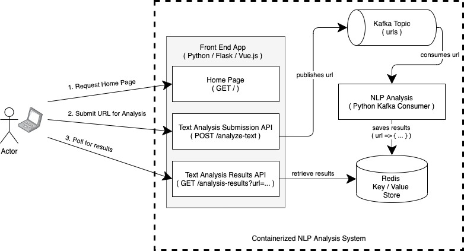
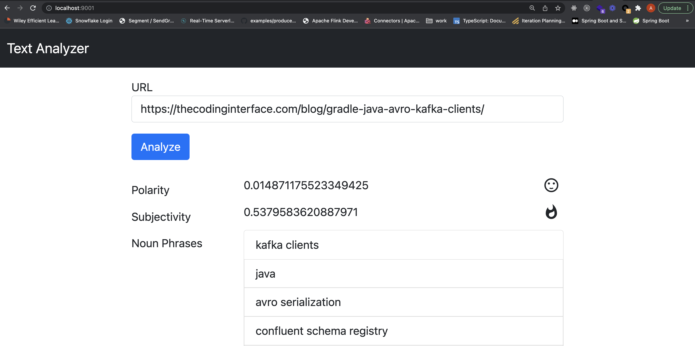

## Harnessing the Power of Containers for Rapid Experimentation

### Introduction

Technology drives maximal value to the enterprise not through wielding the power of specific programming languages but by composing multiple component technologies into systems that model, automate and deliver complex business processes. Luckily there exists the amazing world of Docker, container tools and the ecosystem of images. Collectively these significantly lower the technical barrier to experimenting with a wide variety of technologies leading to faster cycles of learning and innovation. In the container world there are endless purpose built images provided by open source communities and vendors with popular technologies installed and configured to run with minimal effort. Containers can be stitched together and run as Docker Compose services in relatively short order. 

### Overview of the Demo Application

In this article I present an example system providing machine learning (ML) based text analytics where a user submits a web page URL to a browser and is presented with measures of sentiment (polarity and subjectivity) along with extracted noun phrases predicted to be semantically meaningful. The system is constructed of multiple containerized technologies and is deployed to a Docker environment running on my laptop as a set of Docker Compose services. 

Below is the high-level architecture of the system and the source code can be found on [GitHub](https://github.com/amcquistan/k8s-nlp-sentiment).



The frontend application utilizes the Python based Flask microframework along with Vue.js for an interactive UI. The URL is submitted via the frontend and relayed to a Kafka topic. Next another containerized Python application consumes the URL from Kafka and utilizes the open source Text Blob and Natural Language Toolkit (NLTK) ML libraries to perform text analytics then writes the result to a Redis key/value store running in yet another container. While this happens Javascript in the frontend polls a REST API for results matching to the original URL then displays them in the browser.

The Flask app source is contained in a single file shown below consisting of a handler function that serves up the UI web page and two REST based endpoints. One REST endpoint is for handling a POST request with the URL then producing it to the containers running Kafka and the second REST endpoint is for fetching the results of the analysis.  

```
# nlpapp/app.py

import atexit
import json
import logging
import os
import sys

import redis

from flask import Flask, render_template, request, jsonify

from kafka import KafkaProducer


app = Flask(__name__)


def make_kafka_producer():
    import time
    time.sleep(10) # make sure kafka is up
    producer = KafkaProducer(bootstrap_servers=[os.environ['BOOTSTRAP_SERVER']])
    atexit.register(lambda p: p.flush(), producer)
    return producer

producer = make_kafka_producer()


redis_client = redis.Redis(host=os.environ['REDIS_HOST'], port=6379)


@app.route('/')
def home():
    return render_template('home.html')


@app.route('/analyze-text', methods=('POST',))
def analyze_text():
    request_data = request.get_json()
    url = request_data['url']

    try:
        producer.send(os.environ['KAFKA_TOPIC'], url.encode('utf-8'))\
            .add_callback(SuccessCallback(url))\
            .add_errback(ErrCallback(url))
        redis_client.delete(url)

        return jsonify({'status': 'submitted', 'message': 'submitted for analysis {url}'.format(url=url)})
    except Exception as e:
        app.logger.error("Error submitting url", exc_info=e)

    return jsonify({'status': 'failed'})


@app.route("/analysis-results")
def analysis_results():
    url = request.args.get('url')
    results = {}
    try:
        results = json.loads(redis_client.get(url).decode('utf-8'))
    except Exception as e:
        app.logger.error("Error fetching results", exc_info=e)

    return jsonify(results)


class SuccessCallback:
    # ... omitted for brevity


class ErrCallback:
    # ... omitted for brevity
```

The next key part is the Kafka consumer which fetches the webpage of the URL pulled from Kafka and utilizes the TextBlob library for text analysis as shown below.

```
# nlpconsumer/webnlp.py

import json
import logging
import os
import sys

import redis
import requests

from bs4 import BeautifulSoup
from kafka import KafkaConsumer
from textblob import TextBlob


logger = logging.getLogger(__name__)


def main(args):
    logger.info("Started nlpconsumer")
    redis_client = redis.Redis(host=args['redis_host'], port=6379)
    consumer = KafkaConsumer(args['topic'],
                            bootstrap_servers=args['bootstrap_servers'],
                            group_id=args['consumer_group'])

    for message in consumer:
        url = message.value.decode('utf-8')
        logger.info("processing " + url)
        try:
            response = requests.get(url)
            soup = BeautifulSoup(response.content)
            text = soup.get_text()
            blob = TextBlob(text)
            text_analysis = TextAnalysis(url, blob)
            redis_client.set(url, json.dumps(text_analysis.to_dict()))
        except Exception as e:
            logger.error(f"Failed analyzing {url}", exc_info=e)


class TextAnalysis:
    def __init__(self, url : str, blob : TextBlob):
        self.url = url
        self.polarity = blob.sentiment.polarity
        self.subjectivity = blob.sentiment.subjectivity
        self.nouns = [str(w) for w in blob.noun_phrases]

    def to_dict(self):
        return {
          'url': self.url,
          'polarity': self.polarity,
          'subjectivity': self.subjectivity,
          'nouns': self.nouns
        }


if __name__ == '__main__':
    import time
    time.sleep(10) # make sure other services are up
    args = {
        'bootstrap_servers': os.environ['BOOTSTRAP_SERVER'],
        'topic': os.environ['KAFKA_TOPIC'],
        'consumer_group': os.environ['CONSUMER_GROUP'],
        'redis_host': os.environ['REDIS_HOST']
    }

    main(args)
```


Rather than dumping a heap of HTML, CSS and Javascript into the article I’ve chosen to just show an image of the UI. Curious readers can have a look at the nlpapp/templates/home.html file of the linked GitHub repo.




### Running on Docker

Now that the basic components of the system have been discussed I can demonstrate what is needed to stitch the pieces together in Docker containers and run them locally with Docker Compose. 

The frontend app is containerized per the instructions in the Dockerfile shown below. This packages up the previously presented Flask microframework web application along with the other required Python dependencies and launches it using the Gunicorn application server.


```
FROM python:3.8-slim-buster

COPY requirements.txt /

RUN pip3 install -r /requirements.txt

COPY nlpapp/ /app
WORKDIR /app

EXPOSE 5000

ENTRYPOINT ["gunicorn", "app:app", "--threads", "5", "-b", "0.0.0.0:5000"]
```

The Kafka consumer and subsequent text analytics program is similarly containerized per the following Dockerfile. Here the various Kafka and text analytics libraries are packaged into the container along with the Python consumer source code and launched as a standalone program.

```
FROM python:3.8-slim-buster

COPY requirements.txt /

RUN pip3 install -r /requirements.txt && python -m textblob.download_corpora

WORKDIR /app
ADD . .

ENTRYPOINT ["python", "webnlp.py"]
```

The remaining components are the Kafka message bus cluster and a Redis key/value store which are normally fairly complex pieces of technology to install and configure. However, Confluent provides open source community licensed images for both Zookeeper and the Kafka broker. The Redis open source project provides a similarly well established image as well. So all that remains is to assemble a docker-compose.yml file which composes the various containers into a single deployable unit as shown below.

```
version: '2'
services:
  zookeeper:
    image: confluentinc/cp-zookeeper:6.1.1
    hostname: zookeeper
    container_name: zookeeper
    ports:
      - "2181:2181"
    environment:
      ZOOKEEPER_CLIENT_PORT: 2181
      ZOOKEEPER_TICK_TIME: 2000

  broker:
    image: confluentinc/cp-kafka:6.1.1
    hostname: broker
    container_name: broker
    depends_on:
      - zookeeper
    ports:
      - "29092:29092"
      - "9092:9092"
      - "9101:9101"
    environment:
      KAFKA_BROKER_ID: 1
      KAFKA_ZOOKEEPER_CONNECT: 'zookeeper:2181'
      KAFKA_LISTENER_SECURITY_PROTOCOL_MAP: PLAINTEXT:PLAINTEXT,PLAINTEXT_HOST:PLAINTEXT
      KAFKA_ADVERTISED_LISTENERS: PLAINTEXT://broker:29092,PLAINTEXT_HOST://localhost:9092
      KAFKA_OFFSETS_TOPIC_REPLICATION_FACTOR: 1
      KAFKA_TRANSACTION_STATE_LOG_MIN_ISR: 1
      KAFKA_TRANSACTION_STATE_LOG_REPLICATION_FACTOR: 1
      KAFKA_GROUP_INITIAL_REBALANCE_DELAY_MS: 0

  nlpapp:
    build: nlpapp
    container_name: nlpapp
    environment:
      BOOTSTRAP_SERVER: "broker:29092"
      KAFKA_TOPIC: "urls"
      REDIS_HOST: redis
    depends_on:
      - redis
      - broker
      - nlpconsumer
    ports:
      - "9001:5000"

  nlpconsumer:
    build: nlpconsumer
    container_name: nlpconsumer
    environment:
      BOOTSTRAP_SERVER: "broker:29092"
      KAFKA_TOPIC: "urls"
      REDIS_HOST: redis
      CONSUMER_GROUP: urls-0
    depends_on:
      - redis
      - broker

  redis:
    image: redis
    hostname: redis
    container_name: redis
    ports:
      - "6379:6379"
```

Execute the following command in the same directory as this project’s docker-compose.yml file. 

```
docker-compose up
```

With that single command the Docker Compose services are launched and after a minute or two I can point my browser to http://127.0.0.1:9001 and I’m presented with the demo app.

Pretty amazing right?

### Conclusion

In just a few hundred lines of code plus a couple of Dockerfiles and some YAML I was able to cobble together a reasonably complex proof of concept (POC) style demo application. In doing so I got a feel for event driven architecture, Redis key-value datastore, Kafka based pub/sub messaging, Python REST APIs and text analytics. However, the learning doesn’t need to stop there. One could experiment with swapping out the Kafka message bus with something else like Celery and RabbitMQ or even just Celery with Redis. Similarly, I could spin up a MongoDB or Cassandra database to take the place of the Redis key/value store or swap out the frontend from a Python Flask implementation to Java Springboot. 

### Acknowledgements

I'd like to thank Linda Rohr and Jerrid Derr for their support and feedback on this article.
